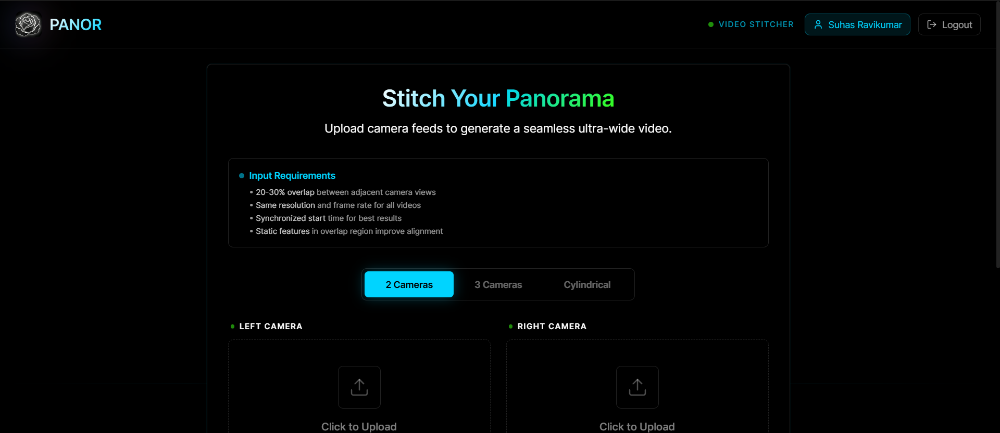

# PANOR - GPU-Accelerated Video Panorama Stitcher

A web application that stitches multiple camera video feeds into seamless panoramic videos using CUDA GPU acceleration and computer vision. Optionally detect and track objects (people, cars, etc.) in real-time with YOLOv8.



---

## Features

- **Multi-Camera Stitching** - Combine 2 or 3 camera feeds into a single wide-angle panoramic video
- **Cylindrical Mode** - Wide field-of-view stitching with cylindrical warping for reduced distortion
- **GPU Accelerated** - CUDA-powered warping, color correction, and NVENC video encoding
- **YOLOv8 Object Detection** - Optional real-time detection and tracking of people, vehicles, and more
- **Moving Camera Support** - Handles both static rigs and vehicle-mounted cameras
- **Frame Rate Sync** - Automatically normalizes different FPS sources
- **Auto Cropping** - Removes black borders from the final output
- **User Authentication** - JWT-based login/signup system
- **Modern UI** - Animated React frontend with real-time progress updates

---

## Prerequisites

- **Python 3.10+**
- **Node.js 18+**
- **FFmpeg** (must be on PATH)
- **NVIDIA GPU** with CUDA support (recommended for performance)
- **OpenCV with CUDA** (optional, falls back to CPU)

### For YOLO Object Detection (optional)

```bash
pip install ultralytics torch torchvision
```

---

## Installation

### 1. Clone the repository

```bash
git clone https://github.com/<your-username>/panor.git
cd panor
```

### 2. Install backend dependencies

```bash
cd backend
pip install -r requirements.txt
cd ..
```

### 3. Install frontend dependencies

```bash
cd frontend
npm install
cd ..
```

---

## Running Locally

### Quick Start (Windows)

Double-click `run.bat` to start both the backend and frontend.

### Manual Start

Open two terminals:

**Terminal 1 - Backend:**

```bash
cd backend
python main.py
```

The backend runs at `http://localhost:8000`.

**Terminal 2 - Frontend:**

```bash
cd frontend
npm run dev
```

The frontend runs at `http://localhost:5173`.

---

## How to Use

### Step 1 - Sign Up / Log In

Open `http://localhost:5173` in your browser. Click the **Sign Up** button to create an account, or **Log In** if you already have one.

### Step 2 - Choose a Stitching Mode

Select one of the three modes at the top of the upload form:

| Mode | Cameras | Best For |
|------|---------|----------|
| **2 Cameras** | Left + Right | Simple side-by-side setups |
| **3 Cameras** | Left + Center + Right | Wider panoramic coverage |
| **Cylindrical** | Left + Right | Wide FOV with less edge distortion |

### Step 3 - Upload Videos

Click each upload box to select video files for the corresponding camera position.

**Requirements for best results:**
- 20-30% overlap between adjacent camera views
- Same resolution and frame rate across all videos
- Synchronized start times
- Static features in the overlap region improve alignment

Supported formats: MP4, AVI, MOV

### Step 4 - Configure Options

Toggle these settings under the **Configuration** section:

| Option | Default | Description |
|--------|---------|-------------|
| **Moving Camera Mode** | Off | Enable for vehicle-mounted or handheld cameras. Recalculates alignment per frame instead of locking to the first frame. |
| **YOLO Tracker** | Off | Detect and track objects (people, cars, trucks, motorcycles) in the stitched output. Requires `ultralytics` to be installed. |

### Step 5 - Process

Click **Start Processing**. The progress bar shows real-time status including GPU utilization.

### Step 6 - Download Result

Once processing is complete, preview the stitched panorama in the built-in video player and click **Download** to save it.

---

## Project Structure

```
panor/
├── backend/
│   ├── main.py              # FastAPI server and API endpoints
│   ├── auth.py              # JWT authentication system
│   ├── processor.py         # Background video processing jobs
│   └── requirements.txt     # Python dependencies
├── frontend/
│   ├── src/
│   │   ├── App.jsx          # Main application component
│   │   └── components/
│   │       ├── AuthModal.jsx        # Login/signup UI
│   │       ├── UploadForm.jsx       # Video upload and config
│   │       ├── ProcessingStatus.jsx # Real-time progress
│   │       └── ResultView.jsx       # Result viewer/download
│   ├── package.json
│   └── vite.config.js
├── panor.py                 # Core GPU-accelerated stitching engine
├── cylindrical.py           # Cylindrical warping module
├── run.bat                  # Quick start script (Windows)
└── render.yaml              # Render.com deployment config
```

---

## API Endpoints

| Method | Endpoint | Description |
|--------|----------|-------------|
| `POST` | `/api/auth/signup` | Create a new account |
| `POST` | `/api/auth/login` | Log in and get a JWT token |
| `GET` | `/api/auth/me` | Get current user info |
| `POST` | `/api/upload` | Upload videos and start stitching |
| `GET` | `/api/status/{job_id}` | Poll job progress |
| `GET` | `/api/download/{filename}` | Download the stitched result |

Interactive API docs available at `http://localhost:8000/docs` when the backend is running.

---

## Deployment

### Render

The project includes a `render.yaml` blueprint. Connect your GitHub repo to Render and it will auto-deploy both the backend (web service) and frontend (static site).

### Railway

A `railway.json` config is included for Railway deployments.

---

## Environment Variables

| Variable | Default | Description |
|----------|---------|-------------|
| `SECRET_KEY` | Auto-generated | JWT signing secret |
| `VITE_API_URL` | `http://localhost:8000/api` | Backend API URL for the frontend |
| `USERS_DB_PATH` | `backend/users_db.json` | Path to user database file |

---

## Tested Datasets

The project has been validated against the following public and custom datasets:

| Dataset | Description | Use Case |
|---------|-------------|----------|
| [Waymo Open Dataset](https://drive.google.com/drive/folders/10kc3cGtZnUcN_5r86Gi0sAMdScA5x_OP?usp=sharing) | Autonomous vehicle multi-camera footage | Front-left, front, front-right camera stitching |
| [StabStitch-D](https://drive.google.com/drive/folders/1f32_RLQawtfqldfh-64HYj7yrjSrMKtz?usp=sharing) | ECCV2024 benchmark with 100+ video pairs | Diverse scenes: regular, low-texture, low-light, fast-moving |
| [Static Dataset](https://drive.google.com/drive/folders/11fApYmZr2WuBt4A3CA1uWgIS5cIHiWvR?usp=sharing) | Fixed camera static recordings | Static camera panorama stitching |
| [Static Dataset 2](https://drive.google.com/drive/folders/1JtzsE5GxcC1FbBnoeBQGQS7v9TgcGLHC?usp=sharing) | Additional fixed camera recordings | Static camera panorama stitching |
| Custom GoPro | Personal multi-camera recordings | General panorama creation |

### Which script to use per dataset

| Dataset | Script |
|---------|--------|
| Waymo Open Dataset | `3camera.py` |
| StabStitch-D | `2camera.py` |
| Static Dataset / Static Dataset 2 | `no_gpu_static.py` |

---

## Tech Stack

**Frontend:** React 19, Vite, Tailwind CSS, Framer Motion, Axios

**Backend:** Python, FastAPI, Uvicorn, OpenCV, NumPy

**ML/CV:** YOLOv8 (ultralytics), CUDA, NVENC/NVDEC

---

## License

MIT
